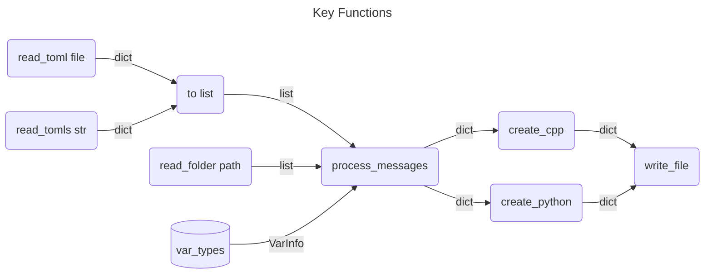

# Messages
[](https://github.com/gecko-robotics/messages/actions/workflows/python.yml)


**Still Under Development**

## Why?

I find myself constantly changing message formats in one language and then 
another is out of sync. This way, if I change the message format, it is
easy to recompile for both Python and C++. For the actual serialization
I use yivo.

Why not use *insert favorit here*?

- protobuf: generates massive header files and I want this to run on small
  micro controllers
- msgpack: more serialization than defining messages

Why `toml`?

It seemed good enough and it is used for configuration. There is no reason I
couldn't switch the front end from `toml` to `json` or something else. All I 
need is a python dictionary to be feed info `create_c/py`. I just wanted a 
parser to real some file and return a dictionary of information.

## Architecture



Message formats should be short and simple, but if you want, it can also be complex.

## Binary

```
msgcomp [--out_dir=DIR][--in_dir=DIR][--version][--verbose][--help][--cpp-only][--python-only]
```

```
$ gmsg 
Found 9 message files
Namespace: quad
 MsgID NAME
------------------------
 -   1 vec
 -   2 quat
 -   3 twist
 -   4 wrench
 -   5 pose
 -  20 heartbeat
 -  40 calibration_t
 -  40 imu_raw_t
 -  41 imu_t
[ C++ ]
 Saving to /Users/kevin/github/quadcopter/messages/cpp
 -> vec_t.hpp
 -> quat_t.hpp
 -> twist_t.hpp
 -> wrench_t.hpp
 -> pose_t.hpp
 -> calibration_t.hpp
 -> imu_raw_t.hpp
 -> imu_t.hpp
 -> heartbeat.hpp
[ Python ]
 Saving to /Users/kevin/github/quadcopter/messages/python
 -> vec_t.py
 -> quat_t.py
 -> twist_t.py
 -> wrench_t.py
 -> pose_t.py
 -> calibration_t.py
 -> imu_raw_t.py
 -> imu_t.py
 -> heartbeat.py
```

## Message File Data Types

Messages can use standard language types:

| Message    | C            | Python   |
|------------|--------------|----------|
| `[u]int8`  | `[u]int8_t`  | `int`    |
| `[u]int16` | `[u]int16_t` | `int`    |
| `[u]int32` | `[u]int32_t` | `int`    |
| `[u]int64` | `[u]int64_t` | `int`    |
| `float`    | `float`      | `float`  |
| `double`   | `double`     | `double` |

Or complex types that were inspired by ROS:

| ID | Message  | Info                             |
|----|----------|----------------------------------|
| 1  | `vec`    | {float x,y,z}
| 2  | `quat`   | {float w,x,y,z}
| 3  | `twist`  | {vec_t linear, vec_t angular}
| 4  | `wrench` | {vec_t force, vec_t torque}
| 5  | `pose`   | {vec_t position, quat_t orientation}


## Global

Now you can shorten your message file because a lot of the keys are repetitive across
message files. Basically, anything in the “global” space of a message file can be moved
to a `global.toml` file instead of putting it into a message file.

```toml
[global]
comments = "string"
namespace = "string"
license = "string" # full text of what you want at the top of each file
version = "string" # anything you want like 1.0.2 or 2022.2.23
frozen = "bool"    # is python dataclass frozen true or false
wrap_width = "int" # line width for text wrapping, default = 70

[global.serialize]
yivo = "bool"         # true | false
mavlink = "bool"

# put native types in var_types VarTypes(name, size, fmt, id) ... native ids = 0,
# complex ids > 0, remove complex altogether ids between 20 - 255. This is nice
# to put message ids here, because you can see them all in one place and know you don’t
# have any conflicts.
[global.ids]
imu_t = "int"
calibration_t = "int"
my_cool_msg = "int"
awesome_msg = "int"
```

## Message

```toml
[enum.name] # optional, can have many of these, each must have
            # an original name and each value in an enum must
            # be unique (python uses `@unique` from `enum`
            # library)
Val1 = 1
Val2 = 2
Val3 = 3

# since python is not a strongly typed language, it will not always respect
# default types, so what should be an array (float[3]), you can set to a
# scalar int. C is the only one that will complain if you do this.
[message]
# type-var_name = array_dimension
x = "float"                    # float x = 0 or default
y = {type = "float", len = 2}  # float y[2]{0,0} or default
z = "float"                    # var names can only be ascii letters, numbers and -
a = {type = "vec", len = 2, default = [[0,0,0],[0,0,0]]}  # vec_t a[2]{{0,0,0},{0,0,0}}
                                                          # add `#include “vec_t.hpp”` and
                                                          # `from vec_t import *` when generated

comments = "string" # optional, will be attached to the `struct`
id = "bool"         # can be in global.toml [ids] or here, value must be between 20 - 255
frozen = "bool"     # only for python dataclass

# this is really a message library for serialization, so only put functions if
# you really need to, otherwise, let some other part of your code base
# handle this
[functions]
c = "string"
python = "string"
```

The minimum message file is:

```toml
[message]
x = "float"
id = 33  # this can be in global.toml under [global.ids]
name = "simple"
```

## Example

```toml
[message]
# var_name = type
# var_name = {type, len, default} only type is required
x = "uint32" # len = 1
y = {type = "float", len = 3, default = [0,0,0]}
z = {type = "uint8", default = 2} # len = 1
m = {type = "int16", len = 2}
name = "test"
id = 33
```

```python
{'message': {'x': 'uint32', 'y': {'type': 'float', 'len': 3, 'default': [0, 0, 0]}, 'z': {'type': 'uint8', 'default': 2}, 'm': {'type': 'int16', 'len': 2}, 'name': 'test', 'id': 33}}
```

## To Do

- [ ] Maybe move `id` and `name` to a `meta` key so you can have a key
    in the `message` that is call one of those two?
    ```toml
    [message]
    x = "float"
    [message.meta]
    id = 33  # this can be in global.toml under [global.ids]
    name = "simple"
    ```
- [ ] Maybe include `[message.method] {c = "string", py = "string"}`
- [x] Maybe do `x = "int"` or `x = {type = 'int', len = 3, default = [0,0,0]}`?
- [ ] Fix `python` 3.8 - 3.10 with `tomlkit`
    - `tomlkit` doesn't seem to work ... just stick with `tomllib`?
- [ ] Fix comments ... do I need them?
- [x] Add global wrap size default to 70 char wide
- [x] Add `py` and `c` for builtin messages, want `vec` in message and `vec_t` in `c`
- [ ] Fix or remove automatic defaults, messages with new types are not
      getting setup correctly with defaults. Only allow custom defaults
      for new messages? Maybe embed default in each type class or `None`
      if no default? Still don't like how I am doing defaults or if they are
      needed
    - [x] Add defaults to variable
    - [ ] OR add one default for whole message
    - [ ] If default available use it
    - [ ] If custom default in message available, it has priority

Potential new tpes:

| Message    | C            | Python   |
|------------|--------------|----------|
| dynamic array | vector | list

[ros 2 types](https://docs.ros.org/en/foxy/Concepts/About-ROS-Interfaces.html#field-types)

# MIT License

**Copyright (c) 2023 gecko-robotics**

Permission is hereby granted, free of charge, to any person obtaining a copy
of this software and associated documentation files (the "Software"), to deal
in the Software without restriction, including without limitation the rights
to use, copy, modify, merge, publish, distribute, sublicense, and/or sell
copies of the Software, and to permit persons to whom the Software is
furnished to do so, subject to the following conditions:

The above copyright notice and this permission notice shall be included in all
copies or substantial portions of the Software.

THE SOFTWARE IS PROVIDED "AS IS", WITHOUT WARRANTY OF ANY KIND, EXPRESS OR
IMPLIED, INCLUDING BUT NOT LIMITED TO THE WARRANTIES OF MERCHANTABILITY,
FITNESS FOR A PARTICULAR PURPOSE AND NONINFRINGEMENT. IN NO EVENT SHALL THE
AUTHORS OR COPYRIGHT HOLDERS BE LIABLE FOR ANY CLAIM, DAMAGES OR OTHER
LIABILITY, WHETHER IN AN ACTION OF CONTRACT, TORT OR OTHERWISE, ARISING FROM,
OUT OF OR IN CONNECTION WITH THE SOFTWARE OR THE USE OR OTHER DEALINGS IN THE
SOFTWARE.
